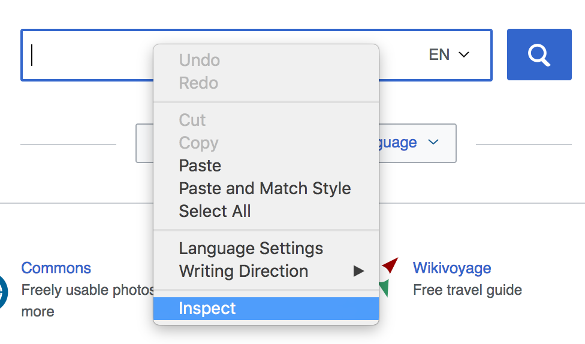
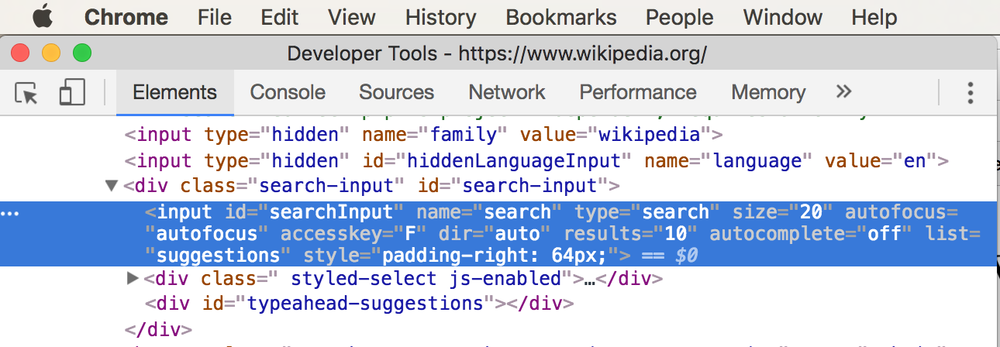

# End to End Testing with Selenium

## Objectives

* Install Selenium
* Control browsers remotely with JavaScript using Selenium
* Load webpages
* Find HTML elements on the page
* Click on HTML elements
* Insert text to HTML input elements
* Verify text content of HTML elements

## Installing Selenium

Let's create a new directory that will hold our testing code, `cd` into it and initialize the directory for npm:

```
mkdir selenium-tests
cd selenium-tests
npm init -y
```

Now install the `selenium-webdriver` package for this project, so we can use it in our tests:

```
npm install selenium-webdriver
```

## Using Selenium

### Requiring Selenium:

We're going to write a test that goes to `https://www.wikipedia.org/`, locates the search box on the home page, enters "javascript" in the input field, submits the search form and allows the browser to be taken to the JavaScript article.  First, though we need create a file for our tests:

```
touch search-wikipedia.js
```

and then inside that file, require `selenium-webdriver`:

```javascript
const selenium = require('selenium-webdriver');
```

The Selenium docs suggest using async / await instead of `.then()` / callbacks, and it makes the code a little more readable, so let's go with that.  After requiring selenium, let's set up an async `main` function and then immediately invoke it.  For the sake of educational clarity, let's write it like this:

```javascript
const main = async ()=> {
   	console.log('hello world!');
}
main();
```

Run the file with 

```
node search-wikipedia.js
```

The script should print `hello world!` to the terminal.

### Initialize Selenium

Now let's initialize Selenium so it knows to run our commands on Chrome.  Let's update our `main` function:

```javascript
const main = async ()=> {
	const driver = await new selenium.Builder().forBrowser('chrome').build();
}
```

Now, when you run the script, it will open up Chrome.  It might take a second initially, so just hang out while it finds Chrome and does its thing.

### Directing the Browser to a URL

Let's have Chrome go do a specific url.  We'll choose Wikipedia, but it could be anything.  First quit Chrome so we don't have multiple instances of the Chrome app running on our computer for each time we run the script.  Then update `main`:

```javascript
const main = async ()=> {
	const driver = await new selenium.Builder().forBrowser('chrome').build();
	await driver.get('https://www.wikipedia.org/');
}
```

Now our script will open Chrome and go to Wikipedia.

### Finding an Element

Our next goal is to have Selenium enter the text "javascript" in Wikipedia's search input field and submit the form.  First, we need to find the input field.  Having looked through the HTML in the browser manually, using the Chrome Developer Tools, I've been able to determine the search input has the id `searchInput`.  Let's use that id to grab the element.  Note there are [many ways](https://www.selenium.dev/documentation/webdriver/elements/finders/) to grab an element besides the id, but in this situation this is an easy way to do it.

To grab an element, we'll first need to define a selection.  Update our `main` definition like so:

```javascript
const driver = await new selenium.Builder().forBrowser('chrome').build();
await driver.get('https://www.wikipedia.org/');
const selection = selenium.By.id('searchInput'); //add this line
```

Currently, if you run the script, you'll notice it doesn't really do anything that it didn't do previously.  That's because we've only defined _how_ we're going to find the element.  Let's now use our `selection` to tell Selenium to actually find it:

```javascript
const driver = await new selenium.Builder().forBrowser('chrome').build();
await driver.get('https://www.wikipedia.org/');
const selection = selenium.By.id('searchInput');
const element = driver.findElement(selection); //add this line
```

### Interacting with an Element

Still no changes that we can detect, but at the code level, we now have a pointer to an element in the page.  Let's use `element` to tell Selenium to simulate a user typing "javascript" into that element:

```javascript
const driver = await new selenium.Builder().forBrowser('chrome').build();
await driver.get('https://www.wikipedia.org/');
const selection = selenium.By.id('searchInput');
const element = driver.findElement(selection);
element.sendKeys('javascript'); //add this line
```

When you run the script, it should appear as those a user has typed "javascript" into the search bar.

### Additional Practice

Now let's submit the search form.  It's very similar to before.  Inside `main` create a selection (once again, I figured out the id by manually scouring the html of the page in Chrome Developer Tools):

```javascript
const driver = await new selenium.Builder().forBrowser('chrome').build();
await driver.get('https://www.wikipedia.org/');
const selection = selenium.By.id('searchInput');
const element = driver.findElement(selection);
element.sendKeys('javascript');

const formSelection = selenium.By.id('search-form'); //add this line
```

Again get a handle on the element:

```javascript
const formSelection = selenium.By.id('search-form');
const formElement = driver.findElement(formSelection); //add this line
```

Now we'll do something slightly different.  We're going to submit the form:

```javascript
const formSelection = selenium.By.id('search-form');
const formElement = driver.findElement(formSelection);
formElement.submit(); //add this line
```

You'll notice that we're using `submit()` instead of `sendKeys()`.  This will submit the form element we've selected.  Similar to element selection, there are [lots of different interactions](https://www.selenium.dev/documentation/webdriver/elements/interactions/) you can have Selenium perform on an element.

Now when you run the script, it will open the browser, search for javascript, and submit the form which takes us the Wikipedia article on Javascript.  Yay!


### Completed Code:

```javascript
const selenium = require('selenium-webdriver');

const main = async ()=> {
	const driver = await new selenium.Builder().forBrowser('chrome').build();
	await driver.get('https://www.wikipedia.org/');
	const selection = selenium.By.id('searchInput');
	const element = driver.findElement(selection);
	element.sendKeys('javascript');

	const formSelection = selenium.By.id('search-form');
	const formElement = driver.findElement(formSelection);
	formElement.submit();
}
main();
```

## Targeting HTML Elements

In order for **Selenium** to interact with websites it needs to know what HTML elements we're interacting with. **Selenium** finds elements in the DOM very much like we do in Vanilla JavaScript or jQuery: we use the DOM. **Selenium** provides us with the `By` property which defines how we look elements up.

We're able to get access to HTML elements in many ways. Refer to the [Static Functions](http://seleniumhq.github.io/selenium/docs/api/javascript/module/selenium-webdriver/index_exports_By.html) attached to the `By` class to see what's all available.

Here are some of the most popular ways elements can be found/used. Each of these can be passed into the `driver.findElement()` function.

* `By.id( id )` - the most common.
* `By.className( name )` - Not very common. Remember that classes appear many times, so looking for something by a class name is ambiguous. It likely returns multiple results.
* `By.css( selector )` - use a complex CSS selector like `#left-nav .section button`
* `By.name( name )` - find an element with a name attribute like `<input name="email" />`
* `By.linkText( text )` - find a link that has text matching *exactly*.
* `By.partialLinkText( text )` - find a link with text that's a partial match.

Here's a useful PDF cheatsheet showing you how to do common things with Selenium:

[Download Selenium Cheatsheet](assets/selenium-cheatsheet.pdf)

## Know Thy Website

If you want to use **Selenium** to interact with a website effectively then you'll need to know the underlying structure of the website. It's easy for us as humans to tell something, "click on the login button." **Selenium** lacks our human understanding. **Selenium** requires us to be ultra-specific and use the DOM when we tell it to find something on the page.

Before you use **Selenium** to interact with a webpage you'll need to perform some initial manual reconnaissance. Load the webpage and use your developer tools to find out the `id` of an element you want to interact with. See if form inputs have `name` attributes you can search for. If there's a link that you want to click on, you can take note of the link text and use the `By.linkText()` and `By.partialLinkText()` methods to obtain a reference to it.

The Wikipedia code we used earlier relied on prior knowledge. Someone else did the initial manual reconnaissance. The wikipedia **Selenium** code relied on knowing the id of the search box and the id of the search form. If you're lucky, then every thing on a website that you want to interact with will have a clean, sensible, easy-to-find id or another attribute that you can use.

The Chrome Developer Tools are extremely helpful when you're trying to find out if something on the page has a useful easy-to-find id. Simply right click on what you want to interact with and choose `Inspect`. Look at the HTML in the `Elements` panel and see if thing has an id on it!

* Use Chrome to open the wikipedia homepage at http://wikipedia.org
* Right click on the main search box
* Select "Inspect"
* The Chrome Developer Tools will open
* Make sure you're on the "Elements" tab and see HTML
* Notice an `<input>` element is highlighted.
* Look to see what the `id` is on the `<input>` element
* The `id` should be "searchInput"





Now that we know the id of the search box. We can use Selenium to grab a reference to the search by using `By.id("searchInput")` and type text into it.

If something doesn't have an id or another easy thing `By` is designed to search for, then you'll end up having to write code that manually sifts through possibilities to find what you're looking for.

If you're designing a website that you want to use **Selenium** with later, then do yourself a favor and add handy ids, names and other identifiers to the element with which you want to interact.

## Exercise: Log into Facebook with Selenium

Make a new file called `facebook-login.js` and write your own **Selenium** code that logs into your Facebook account. You'll need to find a reference to three things:

* The HTML element where you input your username
* The HTML element where you input your password
* The HTML element that you click to log in

Use what you know about using `Right Click -> Inspect` and the Chrome Developer Tools to find IDs.

If you feel weird about typing your Facebook password into a file and saving it then use this boilerplate code. Run `npm install prompt-sync`. The [prompt-sync](https://www.npmjs.com/package/prompt-sync) module will send you prompts in the console, where users can type in their username and password.

```js
const prompt = require('prompt-sync')();

const email = prompt('What is your email?');
const pwd = prompt.hide('What is your password?');
console.log(email, pwd);
```

<details>
	<summary>Facebook Selenium Solution</summary>

```js
const selenium = require('selenium-webdriver');
const prompt = require('prompt-sync')();

const main = async ()=> {
    const driver = await new selenium.Builder().forBrowser('chrome').build();
    await driver.get('https://www.facebook.com/');


    const selectionEmail = selenium.By.id('email');
    const emailElement = driver.findElement(selectionEmail);

    const selectionPassword = selenium.By.id('pass');
    const passwordElement = driver.findElement(selectionPassword);

    const buttonSelection = selenium.By.name('login');
    const buttonElement = driver.findElement(buttonSelection);

    const email = prompt('What is your email?');
    const pwd = prompt.hide('What is your password?');
    console.log(email, pwd);

    emailElement.sendKeys(email)
    passwordElement.sendKeys(pwd)
    buttonElement.submit()

}

main();
```


</details>
